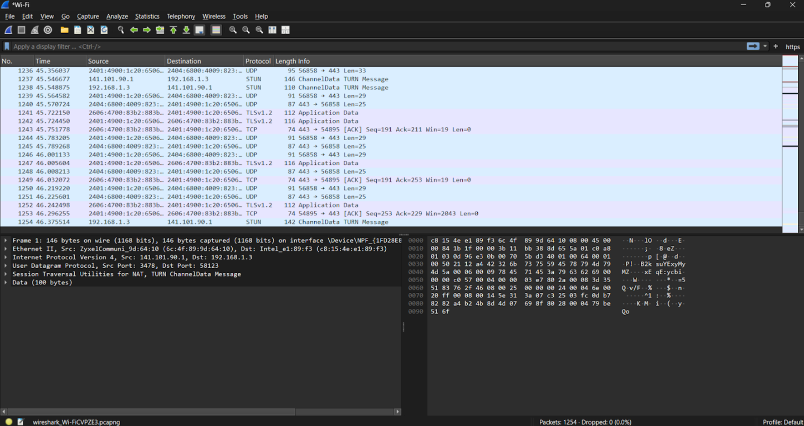
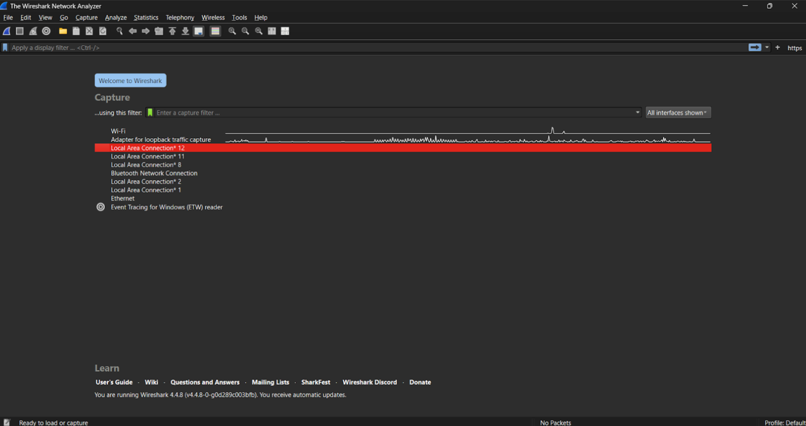
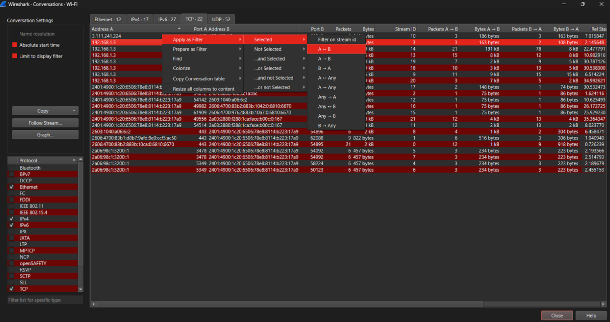
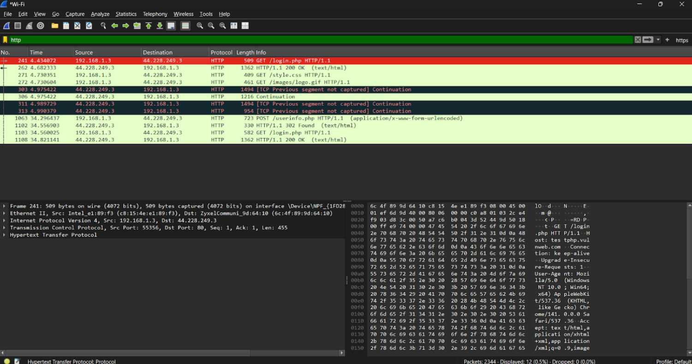
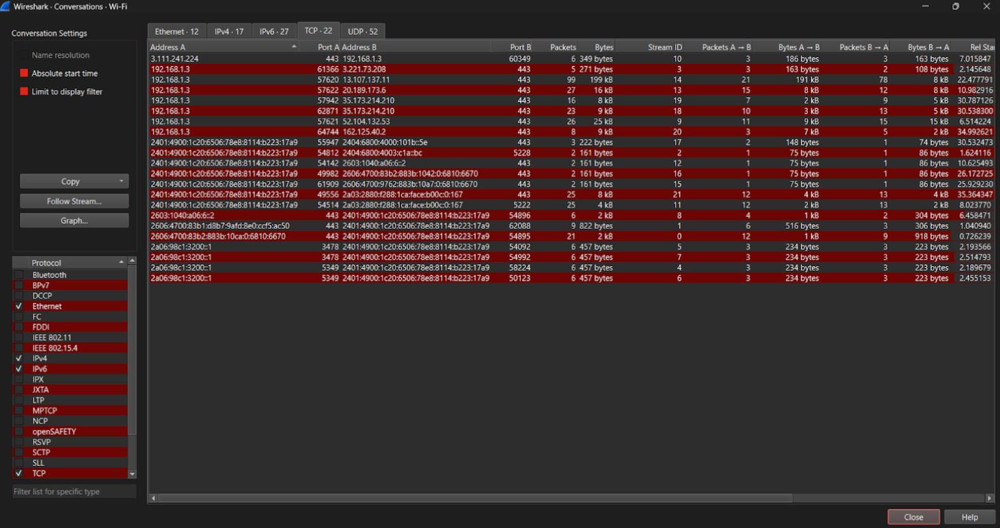
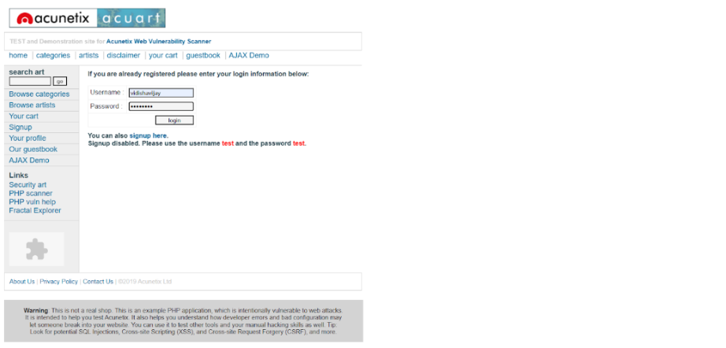
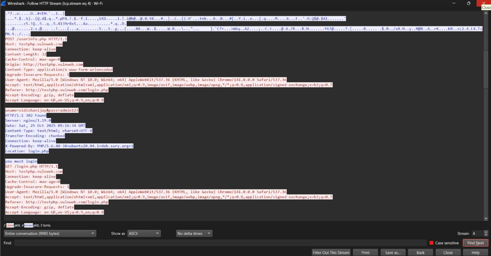
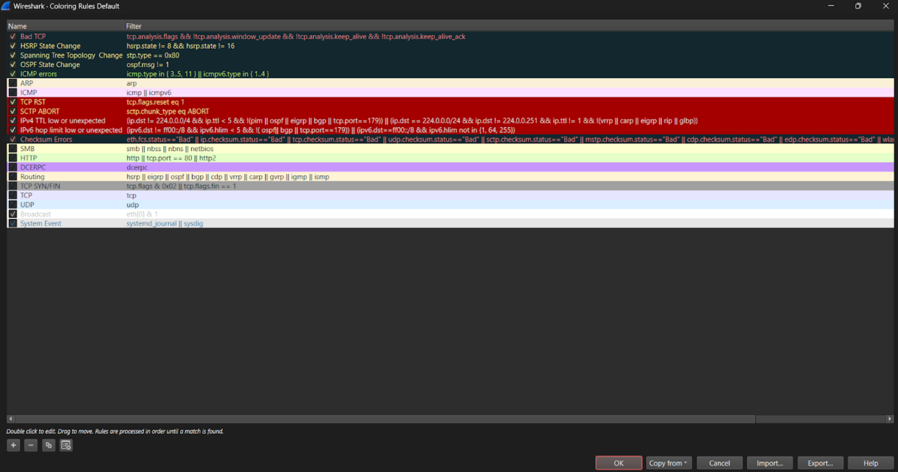

# Network Traffic Analysis using Wireshark

## Overview
This project demonstrates basic network traffic analysis using Wireshark.

## Objectives
- Capture live network packets
- Analyze HTTP, TCP, and UDP traffic
- Apply packet filters
- Understand network communication

## Tools
- Wireshark

## What I Learned
- Packet capture techniques
- Protocol analysis
- Filtering traffic
- Basic network monitoring

## Sample Filters
- tcp
- udp
- http
- ip.addr == <IP>

## Screenshots

### Packet Capture

### Capture Overview

### Applying Filters

### HTTP Filter

### TCP & UDP Analysis

### Login on Unsecure Website

### Credential Analysis

### Coloring Rules

